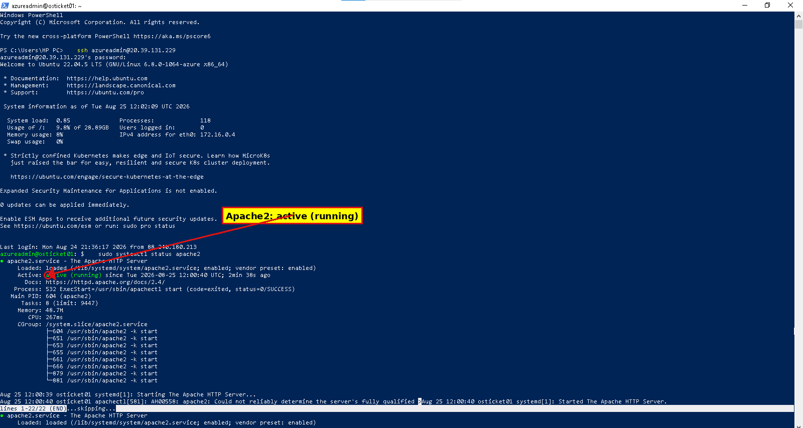
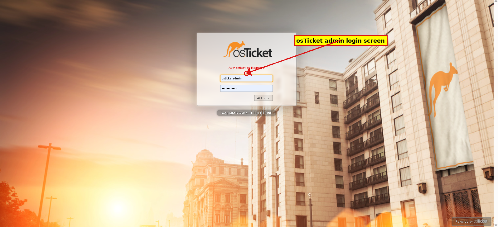

# osTicket — Prerequisites & Installation

## Overview
This project documents the installation of osTicket, an open-source help desk ticketing platform, on a self-hosted Ubuntu server in Microsoft Azure. It covers the full prerequisite stack setup (Apache, MySQL, PHP) through to a working osTicket installation.

## Objective
Stand up a complete LAMP (Linux, Apache, MySQL, PHP) environment from scratch on a fresh Ubuntu VM, then download, configure, and install osTicket on top of it.

## Environment
- **Cloud platform:** Microsoft Azure
- **VM:** `osticket01` — Ubuntu Server 22.04 LTS
- **Web server:** Apache2
- **Database:** MySQL 8.0
- **Scripting language:** PHP 8.1

## Steps Performed

### 1. System Update
Updated all system packages before installing any new software:
```
sudo apt update && sudo apt upgrade -y
```

### 2. Installed Apache Web Server
```
sudo apt install apache2 -y
```
Verified the service was active and running via `systemctl status apache2`.



### 3. Installed and Secured MySQL
```
sudo apt install mysql-server -y
sudo mysql_secure_installation
```
Configured password validation policy, removed anonymous users, disabled remote root login, removed the test database, and reloaded privilege tables.

### 4. Installed PHP and Required Extensions
```
sudo apt install php php-mysqli php-imap php-gd php-mbstring php-curl php-xml php-apcu libapache2-mod-php -y
```
Note: `php-mcrypt` was originally planned but is deprecated and unavailable on this PHP version — its functionality is now built into PHP core, so it was excluded without any loss of functionality.

Apache automatically switched from the `mpm_event` module to `mpm_prefork` to support PHP, and enabled the PHP module.

### 5. Downloaded and Extracted osTicket
```
cd /tmp
wget https://github.com/osTicket/osTicket/releases/download/v1.18.1/osTicket-v1.18.1.zip
sudo apt install unzip -y
unzip osTicket-v1.18.1.zip -d osticket
```

### 6. Deployed to Web Root
```
sudo mv osticket/upload/* /var/www/html/
sudo mv /var/www/html/include/ost-sampleconfig.php /var/www/html/include/ost-config.php
```

### 7. Set File Permissions
```
sudo chown -R www-data:www-data /var/www/html
sudo chmod -R 755 /var/www/html
sudo chmod 0666 /var/www/html/include/ost-config.php
```

### 8. Created the Database
```sql
CREATE DATABASE osticket;
CREATE USER 'osticketuser'@'localhost' IDENTIFIED BY '<password>';
GRANT ALL PRIVILEGES ON osticket.* TO 'osticketuser'@'localhost';
FLUSH PRIVILEGES;
```

### 9. Ran the Web-Based Installer
Navigated to `http://<server-ip>/setup/install.php` and completed the guided installer: helpdesk name, admin account, and database connection details. All requirement checks passed (one optional recommendation for the Intl extension was skipped as non-critical).



### 10. Post-Install Cleanup
Removed the setup directory and the leftover Apache default page, both required steps before the admin panel becomes fully accessible:
```
sudo rm -rf /var/www/html/setup
sudo rm /var/www/html/index.html
```

## Troubleshooting Notes
- **`php-mcrypt` unavailable:** resolved by removing it from the install command — it's obsolete and its functions are bundled into PHP 7.2+.
- **Apache serving default page instead of osTicket:** caused by a leftover `index.html` file in the web root taking priority over `index.php`. Resolved by deleting the default file.
- **VM public IP changes after stop/start:** since this is a dynamic IP, the correct current IP had to be re-checked in the Azure Portal each session before connecting.

## Skills Demonstrated
- Linux server administration (Ubuntu, apt package management)
- LAMP stack deployment from scratch
- MySQL database and user administration
- Web application deployment and file permission management
- Troubleshooting real-world deployment issues

## Status
Complete
